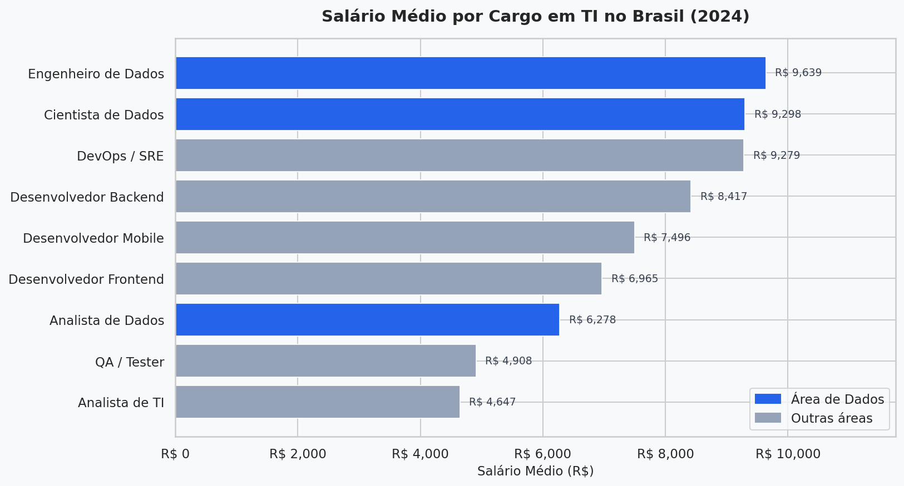
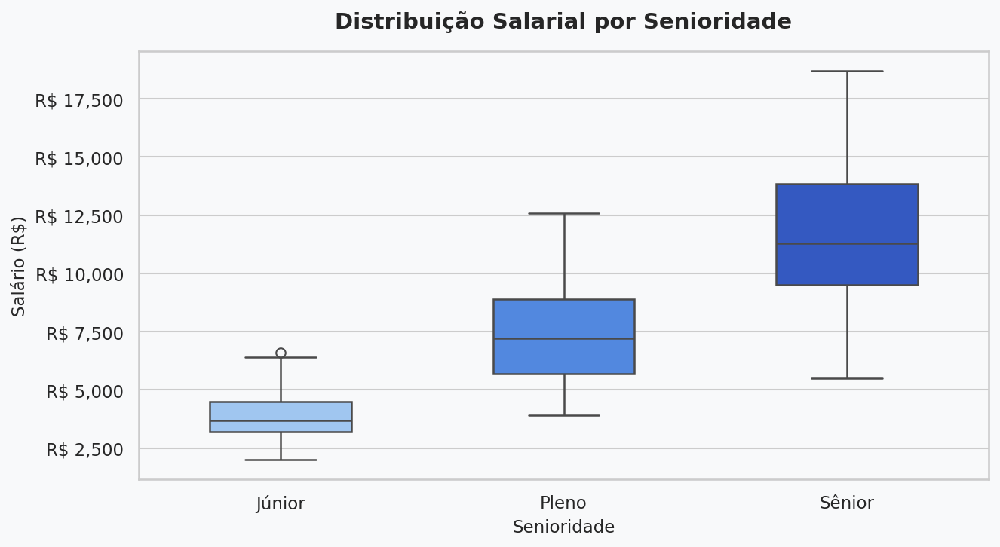
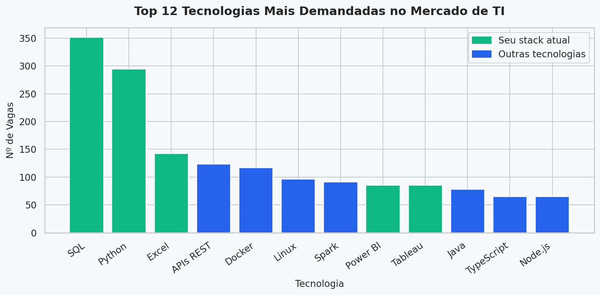
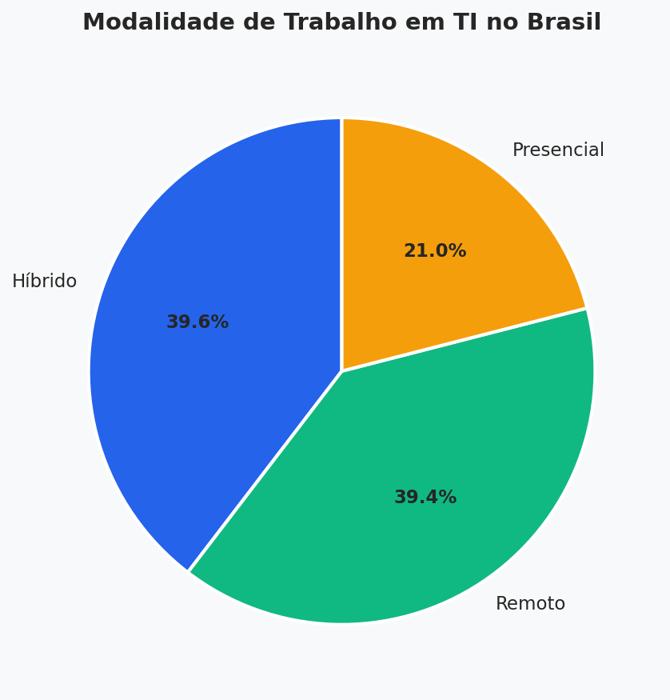

# 📊 Análise do Mercado de TI no Brasil — 2024

Análise exploratória do mercado de tecnologia no Brasil, com foco em salários, tecnologias mais demandadas e modalidades de trabalho por cargo e senioridade.

---

## 🎯 Objetivo

Identificar padrões salariais e de demanda no mercado de TI brasileiro, respondendo perguntas como:

- Quais cargos pagam mais para profissionais júnior?
- Quais tecnologias são mais pedidas pelo mercado?
- Qual a diferença salarial entre as áreas de Dados e TI?
- Como está a distribuição entre trabalho remoto, híbrido e presencial?

---

## 📈 Principais Insights

- 💡 **Analista de Dados Júnior** ganha em média **41% a mais** que Analista de TI Júnior
- 💡 **Python** está presente em **59% das vagas** de tecnologia analisadas
- 💡 **78% das vagas** são remotas ou híbridas
- 💡 **Engenheiro de Dados** é o cargo com maior salário médio (R$ 9.639)

---

## 🛠️ Tecnologias Utilizadas

| Ferramenta | Uso |
|---|---|
| `Python 3.11` | Linguagem principal |
| `Pandas` | Manipulação e análise dos dados |
| `Matplotlib` | Visualizações e gráficos |
| `Seaborn` | Gráficos estatísticos |
| `NumPy` | Geração e processamento de dados |

---

## 📁 Estrutura do Projeto

```
analise-mercado-ti-brasil/
│
├── analise.py                        # Script principal de análise
├── README.md                         # Documentação do projeto
│
├── dados/
│   └── mercado_ti_brasil.csv         # Dataset com 500 registros
│
└── graficos/
    ├── 01_salario_por_cargo.png      # Salário médio por cargo
    ├── 02_salario_senioridade.png    # Distribuição salarial por senioridade
    ├── 03_tecnologias_demandadas.png # Top 12 tecnologias mais pedidas
    └── 04_modalidade_trabalho.png    # Distribuição por modalidade
```

---

## 🚀 Como Executar

**1. Clone o repositório**
```bash
git clone https://github.com/LeoCarrer/analise-mercado-ti-brasil.git
cd analise-mercado-ti-brasil
```

**2. Instale as dependências**
```bash
pip install pandas matplotlib seaborn numpy
```

**3. Execute a análise**
```bash
python analise.py
```

Os gráficos serão gerados automaticamente na pasta `graficos/`.

---

## 📊 Visualizações Geradas

### Salário Médio por Cargo


### Distribuição Salarial por Senioridade


### Tecnologias Mais Demandadas


### Modalidade de Trabalho


---

> ⚠️ **Nota:** Os dados utilizados são sintéticos,
> gerados com distribuições baseadas em pesquisas
> públicas do mercado de TI brasileiro (Stack Overflow
> Survey, Guia Salarial Robert Half 2024).
> O foco do projeto é demonstrar habilidades técnicas
> de análise e visualização de dados com Python.

---

## 👤 Autor

**Leonardo Carrer Lemos**
- Engenharia da Computação | Pós-graduação em Ciência de Dados e Big Data
- [LinkedIn](https://www.linkedin.com/in/leonardo-carrer-lemos/)
- [GitHub](https://github.com/LeoCarrer)
